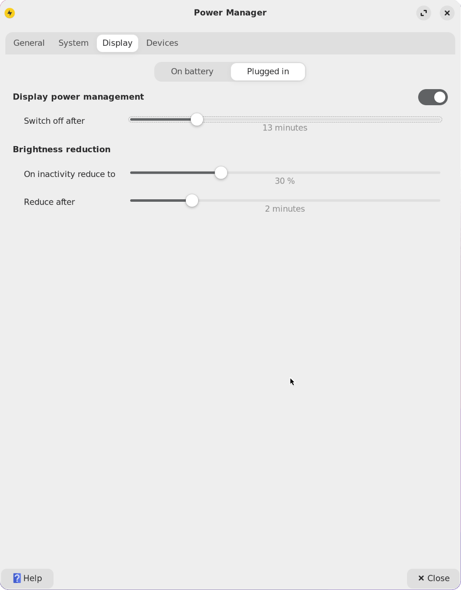
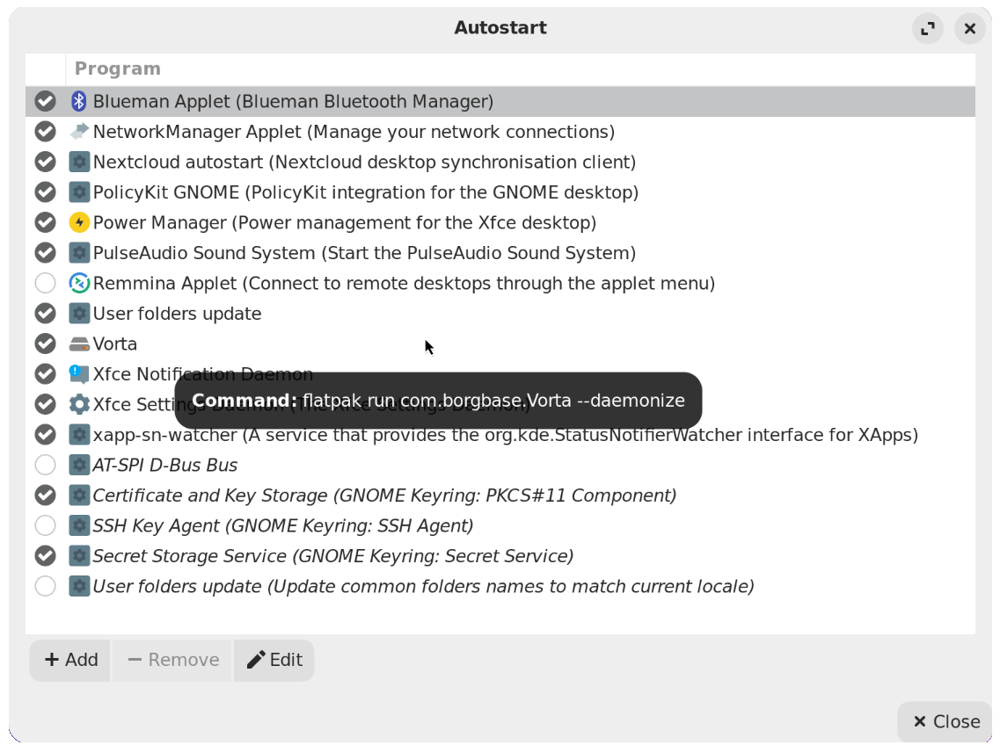

# xfce4-niri

[](https://github.com/passy1977/xfce4-niri/actions/workflows/ci.yml)
[](LICENSE)
[](https://www.rust-lang.org)
[](https://doc.rust-lang.org/edition-guide/rust-2024/)
[](https://github.com/YaLTeR/niri)
[](https://xfce.org)
[](https://github.com/passy1977/xfce4-niri/releases)

A utility to better integrate Xfce4 applications with the niri window manager, creating a minimal, lightweight, and stable desktop environment.

## Install

Debian packages
```sh
sudo apt install \
    pkg-config \
    libgtk-3-dev \
    libglib2.0-dev \
    libdbus-1-dev \
    xdg-user-dirs \
    xdg-desktop-portal \
    dbus \
    xfce4-power-manager \
    upower \
    swayidle \
    swaylock \
    xfce4-session \
    xfce4-panel \
    xfce4-appfinder \
    xfce4-notifyd \
    xfce4-pulseaudio-plugin \
    xfce4-settings \
    xfce4-whiskermenu-plugin \
    thunar \
    ghostty \
    mate-polkit 
```

`niri` is not packaged in Debian/Ubuntu's default repositories yet; install it from your distro's community repo or build it from [source](https://github.com/YaLTeR/niri). Rust (`rustc`/`cargo` >= 1.85) should be installed via [rustup](https://rustup.rs) rather than `apt`, since distro packages usually lag behind the required version.

Void Linux packages
```sh
sudo xbps-install -S \
    pkg-config \
    rust \
    gtk+3-devel \
    glib-devel \
    dbus-devel \
    xdg-user-dirs \
    xdg-desktop-portal \
    dbus \
    xfce4-power-manager \
    upower \
    swayidle \
    swaylock \
    elogind \
    xfce4-session \
    xfce4-panel \
    libxfce4ui \
    libxfce4util \
    libxfce4windowing \
    xfce4-appfinder \
    xfce4-notifyd \
    xfce4-pulseaudio-plugin \
    xfce4-settings \
    xfce4-whiskermenu-plugin \
    thunar \
    ghostty \
    polkit-gnome \
    niri
```

## Build & install

Once the system packages above are installed, build the workspace and install
everything for the current user (no root needed) with:

```sh
./install.sh
```

This script:
- builds `xfce4-niri`, `xfce4-niri-service`, `xfce4-niri-autostart` (`cargo build --workspace --release`)
- installs the binaries into `~/.local/bin` (or `~/bin`, whichever is already on `$PATH`)
- installs [xfce4-niri-config/niri](xfce4-niri-config/niri) into `~/.config/niri`, backing up an existing one first
- installs [xfce4-niri-config/applications](xfce4-niri-config/applications) `.desktop` files into `~/.local/share/applications`

Options: `./install.sh --help` (`--debug` for a debug build, `--bin-dir DIR` to
override the binaries directory, `-y`/`--yes` to skip the overwrite prompt).

## xfce4-niri-service

`xfce4-niri-service` is the background daemon that replaces the pieces of
`xfce4-session`/`xfce4-power-manager` that niri doesn't provide on its own,
keeping a single instance running (via a lock file) for the whole session.
It:

- **Brightness** — watches the backlight device and persists/restores the
  screen brightness across sessions.
- **Lock screen** — integrates with `swaylock`/`swayidle` and honors
  XFCE's presentation-mode setting (via D-Bus/xfconf), so idle locking is
  suspended during presentations just like on stock Xfce.
- **Power management** — talks to `xfce4-power-manager` and `UPower` over
  D-Bus to react to power-source and presentation-mode changes.
- **Autostart** — launches the `~/.config/autostart/*.desktop` entries
  that niri doesn't process on its own.
- **Unix socket** — exposes a small control socket (used e.g. by `xfce4-niri`
  to request `lock_screen`) for other components to talk to the running
  service.

The idle timeout before the screen is locked is read from Xfce4 Power
Manager, so you can adjust it from the usual settings dialog: open
**Xfce4 Power Manager → Display**, then set **Switch off after** under
*On Battery* and/or *Plugged in*.



## xfce4-niri-autostart

`niri` does not process `~/.config/autostart/*.desktop` the way a full
session manager does, so `xfce4-niri-autostart` is a standalone GTK
reimplementation of xfce4-session's "Application Autostart" tab, letting you
manage autostart entries the same way you would on stock Xfce.



- **Program list** — every autostart entry (icon, name and comment), each
  with a checkbox to enable/disable it; hovering a row shows the exact
  command it runs in a tooltip (e.g. `flatpak run com.borgbase.Vorta
  --daemonize`).
- **Toolbar (Add / Remove / Edit)** — add a new autostart entry, remove one,
  or edit an existing entry's name, description and command.
- **Close** — dismisses the window. Changes are written to the underlying
  `.desktop` file as soon as they are made, so nothing needs to be saved
  explicitly.

## niri's keybindings

For the preconfigured keys, see [niri's
keybindings](xfce4-niri-config/README.md#keybindings).

## Reference

The niri configuration is inspired by
[JakeAtLinux/Niri](https://codeberg.org/JakeAtLinux/Niri); see that
repository for details.
